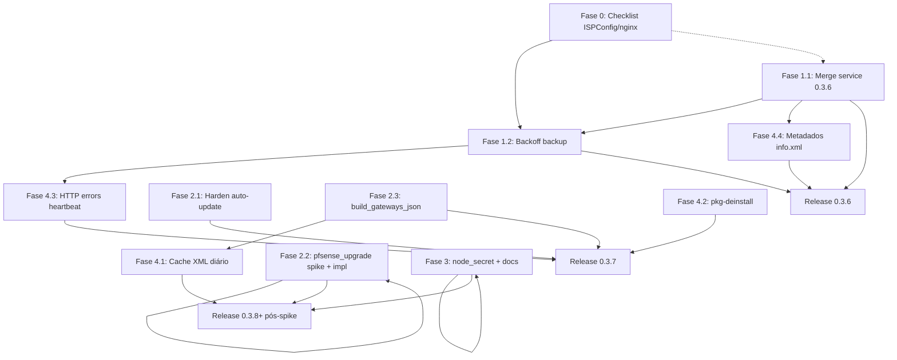

# Plano de melhorias — package pfSense 0.3.6+

**Data:** 2026-06-23  
**Package atual:** `0.3.5`  
**Próxima release alvo:** `0.3.6` (P0); possível `0.3.7` para itens P1 que dependem de spike CE  
**Autor:** plano operacional para continuidade entre chats

---

## Objetivo e escopo

Consolidar e executar melhorias pendentes no **Monitor-Pfsense** com foco no **package pfSense nativo** (`packages/pfsense-package/`), agente shell embarcado, infra nginx/ISPConfig e contratos já existentes com a API NestJS.

Este plano **não implementa código** — é o roteiro autossuficiente para um chat limpo executar as entregas na ordem correta, com critérios de aceite, testes e atualização documental obrigatória.

**Fora de escopo desta trilha (salvo menção):**

- alterações no Zabbix do host
- restore automático de `config.xml` no pfSense
- reabertura das trilhas RBAC ou UX encerradas

---

## Pré-requisitos de leitura (links internos)

Leia nesta ordem antes de implementar:

| # | Documento | Por quê |
|---|-----------|---------|
| 1 | [`LEITURA-INICIAL.md`](../LEITURA-INICIAL.md) | Estado atual e percentuais |
| 2 | [`CORTEX.md`](../CORTEX.md) | Decisões permanentes (push, HMAC, backup, domínios) |
| 3 | [`docs/00-INDICE-OPERACIONAL.md`](00-INDICE-OPERACIONAL.md) | Mapa operacional |
| 4 | [`docs/92-ENTREGA-CORRECAO-WRITE-CONFIG-SEGURO-2026-06-23.md`](92-ENTREGA-CORRECAO-WRITE-CONFIG-SEGURO-2026-06-23.md) | Contexto da correção 0.3.5 (parcial — merge de `service` concluído em 0.3.6) |
| 5 | [`docs/89-ACESSO-INTERNO-E-EXTERNO.md`](89-ACESSO-INTERNO-E-EXTERNO.md) | Fluxo Cloudflare → ISPConfig → compose |
| 6 | [`docs/64-ESPECIFICACAO-MODULO-BACKUP-PFSENSE-2026-06-08.md`](64-ESPECIFICACAO-MODULO-BACKUP-PFSENSE-2026-06-08.md) | Contrato backup + comandos |
| 7 | [`docs/91-PLANO-ENTREGA-PFSENSE-OS-UPGRADE.md`](91-PLANO-ENTREGA-PFSENSE-OS-UPGRADE.md) | Upgrade OS — stub atual e spike CE |
| 8 | [`docs/89-ENTREGA-CORRECAO-BACKUP-AGENDADO-LOOP-2026-06-13.md`](89-ENTREGA-CORRECAO-BACKUP-AGENDADO-LOOP-2026-06-13.md) | Histórico hammer de backup (loop 30s) |
| 9 | [`07-api-e-fluxos.md`](../07-api-e-fluxos.md) | Contrato heartbeat (gateways, serviços) |
| 10 | [`packages/pfsense-package/README.md`](../packages/pfsense-package/README.md) | Build e estrutura do package |

**Arquivos de código centrais:**

- `packages/pfsense-package/files/usr/local/pkg/systemup_monitor.inc`
- `packages/pfsense-package/files/usr/local/pkg/systemup_monitor.xml`
- `packages/pfsense-package/files/usr/local/share/pfSense-pkg-systemup-monitor/systemup_monitor_cli.php`
- `packages/pfsense-package/files/usr/local/libexec/monitor-pfsense-agent/monitor-pfsense-agent.sh`
- `packages/pfsense-package/files/usr/local/libexec/monitor-pfsense-agent/monitor-pfsense-agent-loop.sh`
- `packages/pfsense-package/files/pkg-deinstall.in`
- `packages/pfsense-package/files/usr/local/share/pfSense-pkg-systemup-monitor/info.xml`
- `packages/pfsense-package/pkg-descr`
- `infra/ispconfig/nginx.monitor-pfsense.conf`
- `apps/api/src/ingest/ingest.service.ts` (gateways, heartbeat light)
- `apps/api/src/pfsense-upgrade/pfsense-upgrade.service.ts`

---

## Decisões já tomadas pelo operador

Prioridades acordadas (referência interna A/C):

| Prioridade | Ref | Decisão |
|------------|-----|---------|
| **P0** | A1 / Ponto 4 | Corrigir merge de `installedpackages.service` — mesclar **somente** entrada `monitor_pfsense_agent`, não substituir array inteiro com snapshot stale. Release **0.3.6**. |
| **P0** | C2+C3 / Pontos 2+3 | ISPConfig/502 + hammer de backup — checklist infra detalhado + backoff no agente quando upload falha (502, timeout, auth). |
| **P1** | A2 / Ponto 5 | Endurecer auto-update do package (**não desabilitar** — harden). |
| **P1** | A5 / Ponto 8 | Resolver `pfsense_upgrade` de forma real (não só ocultar stub) — spike CE pré-requisito; feature flag até validação. |
| **P1** | A4 / Ponto 7 | Implementar `build_gateways_json()` e exibir gateways no painel. |
| **P2** | A3 / Ponto 6 | Ajustar `node_secret` da forma mais segura e confiável possível no contexto pfSense. |
| **P2** | A6 / Pontos 9+13 | Documentação coesa + config backup alinhada ao modelo oficial pfSense (fields XML vs PHP externo). |
| **Adicional** | Ponto 14 | Leitura pesada de `config.xml` a cada ~30s → arquitetura com cache diário + heartbeat light para telemetria leve. |
| **Adicional** | Ponto 15 | Desinstalação completa via `pkg-deinstall` com paridade ao `bootstrap/uninstall.sh`. |
| **Adicional** | Ponto 16 | Heartbeat com distinção graceful de falhas HTTP (502 vs auth vs timeout). |
| **Adicional** | Ponto 18 | Corrigir metadados scaffold em `info.xml` / `pkg-descr`. |

---

## Mapa de versões (0.3.6, possível 0.3.7 se necessário)

| Versão | Conteúdo previsto | Observação |
|--------|-------------------|------------|
| **0.3.6** | P0 completo: merge `service` cirúrgico; backoff backup; HTTP errors heartbeat (mínimo); metadados info.xml/pkg-descr; início cache XML (se couber sem spike) | Rollout prioritário na frota afetada por VPN/revert |
| **0.3.7** | P1: `build_gateways_json()`; harden auto-update; desinstalação pkg-deinstall; node_secret fase 1 | Pode ser uma ou duas releases menores |
| **0.3.8+** | P1 `pfsense_upgrade` execução real pós-spike CE; P2 docs/backup fields XML; cache XML completo | Depende de lab CE e flag `PFSENSE_UPGRADE_ENABLED` |

**Regra de versionamento:** bump em `Makefile` (`PORTVERSION`), `SYSTEMUP_MONITOR_AGENT_VERSION` em `systemup_monitor.inc`, `config/package-release.env`, artefato `dist/`, `.cursor/rules/versioning.mdc`.

---

## Fase 0 — Validação infra (P0 2+3) — CHECKLIST ISPConfig

**Status (2026-06-23):** Opção B entregue com evidências no host **221** e testes HTTPS; checklist **253** pendente acesso SSH operador — [`docs/95-ENTREGA-INFRA-BACKUP-LIMIT-2026-06-23.md`](95-ENTREGA-INFRA-BACKUP-LIMIT-2026-06-23.md).

**Objetivo:** eliminar **502 Bad Gateway** e rejeição de body grande na rota de backup **antes** de culpar o agente. O agente hoje roda `backup-scheduled` a cada 30s no loop — falhas repetidas viram hammer.

### 0.1 — Estado esperado da cadeia

```text
pfSense (HTTPS)
  -> Cloudflare (TLS público)
  -> nginx ISPConfig 192.168.100.253
  -> http://192.168.100.221:3031 (compose nginx :8088)
  -> API NestJS (:8088)
```

Referência de snippet: `infra/ispconfig/nginx.monitor-pfsense.conf`

### 0.2 — Checklist no host ISPConfig (`192.168.100.253`)

| # | Verificação | Comando / ação | Critério de aceite |
|---|-------------|----------------|-------------------|
| 1 | Vhost do domínio existe | `grep -RIl 'server_name.*pfs-monitor.systemup.inf.br' /etc/nginx /usr/local/ispconfig/server/nginx/conf /var/www/conf/nginx 2>/dev/null \| head -1` | Arquivo encontrado |
| 2 | Upstream aponta para origem correta | Conferir `set $monitor_origin "http://192.168.100.221:3031"` (ou equivalente) | IP/porta = host do compose |
| 3 | **`client_max_body_size 5m`** na rota backup | `grep -A6 'location = /api/v1/ingest/config-backup' VHOST` | Bloco presente com `5m` |
| 4 | Limite global não bloqueia backup | `grep client_max_body_size VHOST` | Global pode ser `64k`; location backup sobrescreve com `5m` |
| 5 | Timeouts proxy backup | location backup: `proxy_read_timeout` / `proxy_send_timeout` ≥ `120s` | Presentes |
| 6 | Timeouts gerais | `location /`: read/send ≥ `300s` para painel/SSE | Sem timeout prematuro |
| 7 | Headers Cloudflare | `CF-Connecting-IP`, `X-Forwarded-Proto https`, `X-Forwarded-Port 443` | API confia em IP real |
| 8 | Sintaxe nginx | `nginx -t` | OK |
| 9 | Reload | `systemctl reload nginx` | Sem erro |
| 10 | Aplicar snippet automatizado (se ausente) | `scp scripts/ispconfig-apply-monitor-backup-limit.sh root@192.168.100.253:/tmp/` + `bash /tmp/ispconfig-apply-monitor-backup-limit.sh` | Script idempotente |

### 0.3 — Checklist no host compose (`192.168.100.221`)

| # | Verificação | Comando | Critério |
|---|-------------|---------|----------|
| 1 | Stack saudável | `docker compose ps` | api, web, db, nginx up |
| 2 | Health interno LAN | `curl -sS http://192.168.100.221:3031/healthz` | HTTP 200 |
| 3 | Health localhost | `curl -sS http://127.0.0.1:8088/healthz` | HTTP 200 |
| 4 | Limite backup no nginx interno | `grep -A5 config-backup infra/nginx/default.conf` | `client_max_body_size 5m` |
| 5 | Volume backups montado | `compose.yaml` → `data/pfsense-config-backups/` | API grava criptografado |
| 6 | Chave criptografia | `BACKUP_ENCRYPTION_KEY_BASE64` no `.env.api` | 32 bytes base64 |
| 7 | Teste limite upload | `BASE_URL="https://pfs-monitor.systemup.inf.br" ./scripts/verify-config-backup-upload-limit.sh` | Passa sem 413/502 |

### 0.4 — Diagnóstico Cloudflare error 502

| Sintoma | Causa provável | Ação |
|---------|----------------|------|
| 502 só no domínio público; LAN OK | ISPConfig/upstream down ou timeout | Testar `curl -v https://pfs-monitor.systemup.inf.br/healthz` vs LAN; logs nginx 253 |
| 502 só em `config-backup` | `client_max_body_size` ou timeout curto no 253 | Aplicar location dedicada (Fase 0.2 #3) |
| 502 intermitente | API reiniciando / OOM | `docker compose logs api --tail 200` |
| 413 Request Entity Too Large | Limite body antes da API | Corrigir nginx (não é bug do agente) |
| 401/403 no backup | HMAC/timestamp/node | Ver Fase 1 backoff — não confundir com 502 |

**Teste diferencial recomendado:**

```bash
# 1) Origem direta (sem Cloudflare)
curl -sS -o /dev/null -w '%{http_code}\n' http://192.168.100.221:3031/healthz

# 2) Domínio público
curl -sS -o /dev/null -w '%{http_code}\n' https://pfs-monitor.systemup.inf.br/healthz

# 3) Backup (smoke com node real)
./scripts/smoke-config-backup-api.sh
```

### 0.5 — Critério de aceite Fase 0

- [x] `verify-config-backup-upload-limit.sh` verde via HTTPS público *(2026-06-23 — ver `docs/95-ENTREGA-INFRA-BACKUP-LIMIT-2026-06-23.md`)*
- [x] Upload via smoke/API retorna 2xx no fluxo válido *(smoke-config-backup-api; piloto pfSense fora do escopo desta entrega)*
- [x] Documentar evidência em [`docs/95-ENTREGA-INFRA-BACKUP-LIMIT-2026-06-23.md`](95-ENTREGA-INFRA-BACKUP-LIMIT-2026-06-23.md)

---

## Fase 1 — P0 código (merge service, backoff backup)

### 1.1 — A1: Merge cirúrgico de `installedpackages.service` (P0 / Ponto 4)

#### Problema

A correção **0.3.5** (`docs/92-*`) eliminou `write_config()` do `$config` inteiro no resync periódico, mas **`systemup_monitor_export_package_snapshot()` / `import_package_snapshot()` ainda copiam o array completo** `installedpackages.service`:

```php
// export (linha ~379-381 systemup_monitor.inc)
$snapshot['service_entries'] = $config['installedpackages']['service'];

// import (linha ~403-404)
$config['installedpackages']['service'] = $snapshot['service_entries'];
```

Se `$config` em memória estiver stale (mesmo após `config_read()` em corrida com outro package), **outros serviços rc.d registrados por outros packages podem ser removidos ou revertidos** quando o SystemUp Monitor persiste.

#### Mudança proposta

1. **`systemup_monitor_export_package_snapshot()`**
   - Exportar apenas a entrada `monitor_pfsense_agent` (ou `null` se ausente).
   - Renomear chave para clareza: `monitor_service_entry` (manter compatibilidade temporária com alias deprecado se necessário).

2. **`systemup_monitor_import_package_snapshot()`**
   - Carregar `$config['installedpackages']['service']` do disco (pós-`config_read()`).
   - **Upsert** da entrada `monitor_pfsense_agent` via `systemup_monitor_register_service()` (já idempotente).
   - **Nunca** atribuir array inteiro do snapshot.

3. **`systemup_monitor_unregister_service()`**
   - Na desinstalação: remover só nossa entrada; preservar demais.

4. **Testes unitários manuais (pfSense ou PHP local)**
   - Simular `installedpackages.service` com entrada fake de outro package + nossa entrada; persistir; confirmar que a fake permanece.

#### Arquivos

- `packages/pfsense-package/files/usr/local/pkg/systemup_monitor.inc`
- `packages/pfsense-package/files/usr/local/share/pfSense-pkg-systemup-monitor/systemup_monitor_cli.php` (remove/seed)

#### Critério de aceite

- [x] Após save do package, **Configuration History** não remove serviços de terceiros *(validado em test PHP; confirmar em pfSense piloto)*
- [x] Entrada `monitor_pfsense_agent` continua visível em Status → Services *(upsert via register_service)*
- [ ] Regressão VPN/NAT: alterar regra, aguardar 5+ minutos de loop agente, regra intacta *(pendente deploy piloto)*
- [x] Versão **0.3.6** publicada *(commit `6a4a6ed`, dist + `config/package-release.env`)*

---

### 1.2 — C2+C3: Backoff no agente quando backup falha (P0 / Pontos 2+3)

#### Problema

`monitor-pfsense-agent-loop.sh` executa a cada `INTERVAL_SECONDS` (30s):

```sh
"$AGENT_BIN" heartbeat
"$AGENT_BIN" backup-scheduled
```

`backup_upload_config()` grava erro em `last-config-backup-error`, mas **`backup_should_run_scheduled()` não consulta falhas recentes** — com agendamento vencido ou infra instável (502), o agente **martela** o controlador a cada 30s.

O backup já distingue HTTP code (`backup_upload_config` linhas ~1597-1605); o heartbeat **não** (`curl -fsS` sem captura de código).

#### Mudança proposta

1. **Estado de backoff** em `/var/db/monitor-pfsense-agent/backup-upload-backoff.json`:

```json
{
  "consecutive_failures": 0,
  "next_attempt_at": "2026-06-23T12:00:00Z",
  "last_http_code": 502,
  "last_error_class": "upstream"
}
```

2. **Classificação de erro** (`classify_upload_error`):

| Classe | HTTP / condição | Backoff inicial | Teto |
|--------|-----------------|-----------------|------|
| `upstream` | 502, 503, 504, connection reset | 5 min | 6 h |
| `timeout` | 408, curl timeout | 2 min | 2 h |
| `auth` | 401, 403, assinatura | 30 min | 24 h (não escalar agressivo — requer operador) |
| `client` | 400, 413, 422 | 1 h | 24 h |
| `success` | 2xx | reset failures | — |

3. **Exponential backoff:** `delay = min(cap, base * 2^(failures-1))` com jitter ±10%.

4. **`backup_should_run_scheduled()`:** retornar "não executar" se `now < next_attempt_at`.

5. **Comando remoto `config_backup_now`:** respeitar backoff **exceto** se `command_id` presente (operador explícito) — tentar uma vez; se falhar, aplicar backoff.

6. **Log estruturado** uma linha por falha: `backup-backoff class=upstream http=502 next=2026-...`

7. **API (opcional nesta fase):** se hammer persistir, alerta log >30 falhas/h já existe parcialmente — confirmar em `ingest` para backup duplicado.

#### Arquivos

- `packages/pfsense-package/files/usr/local/libexec/monitor-pfsense-agent/monitor-pfsense-agent.sh`
- (Opcional) `scripts/test-backup-schedule-logic.sh` — casos de backoff

#### Testes

- Simular 502 com mock nginx ou `CONTROLLER_URL` inválido temporário
- Verificar que tentativas espaçam (logs + arquivo backoff)
- Após recovery, próximo slot agendado ou sucesso limpa backoff

#### Critério de aceite

- [x] Com 502 simulado, ≤1 tentativa a cada 5 min (primeiro degrau) *(test-backup-backoff.sh)*
- [x] Após sucesso, backoff zerado *(test-backup-backoff.sh)*
- [x] `config_backup_now` manual ainda funciona quando operador solicita *(bypass via command_id)*
- [x] Sem regressão em `docs/89-ENTREGA-CORRECAO-BACKUP-AGENDADO-LOOP-*` (agendamento mensal não loopa) *(test-backup-schedule-logic.sh)*

---

## Fase 2 — P1 (auto-update harden, pfsense_upgrade, gateways)

### 2.1 — A2: Endurecer auto-update do package (P1 / Ponto 5)

#### Estado atual

- GUI e CLI (`systemup_monitor_start_package_update`) baixam release via `GET /api/v1/agent/package-release`
- Comando construído em `systemup_monitor_build_package_update_command()`:
  - `fetch` installer + `install-from-release.sh` em background
  - **`--node-secret` na linha de comando** (visível em `ps`, log)
  - SHA256 validado no installer, mas release cache TTL 300s
  - Sem lock de concorrência além de `pgrep install-from-release`
  - Sem verificação de assinatura do artefato além de SHA256 publicado

#### Mudança proposta (harden, não desabilitar)

| Controle | Implementação |
|----------|---------------|
| Segredo fora de argv | Passar secret via env `MONITOR_UPDATE_NODE_SECRET` ou arquivo temp `0600` consumido pelo installer |
| Lock atômico | Arquivo `/var/run/monitor-package-update.lock` + stale detection |
| Allowlist URL | Validar `artifact_url` / `installer_url` contra prefixos do `controller_url` configurado |
| Pin SHA256 | Recusar update se release não trouxer sha256 ou mismatch |
| Log mínimo | `/tmp/monitor-update.log` sem secret; truncar URLs longas |
| Rate limit local | Máx. 1 update / 24h salvo CLI `--force` |
| Pós-update | `systemup_monitor_cli.php sync` automático no installer |
| Rollback doc | Manter tarball anterior em `/var/db/monitor-pfsense-agent/last-package.tar.gz` (opcional P1) |

#### Arquivos

- `systemup_monitor.inc` (`build_package_update_command`, `start_package_update`)
- `packages/pfsense-package/bootstrap/install-from-release.sh`
- `packages/pfsense-package/files/usr/local/share/pfSense-pkg-systemup-monitor/systemup_monitor_cli.php`

#### Testes

- [x] `release-check` com controller real *(via `test-package-update-harden.php` URL/SHA256)*
- [x] Tentativa de update com URL adulterada → rejeição *(test-package-update-harden.php)*
- [x] `ps aux` durante update não mostra secret *(argv sem `--node-secret`; secret file/env)*

**Status 0.3.7:** entregue — ver `docs/96-ENTREGA-PACKAGE-0.3.7.md`

### 2.2 — A5: `pfsense_upgrade` real (P1 / Ponto 8)

#### O que o backend espera

- Comando `NodeCommandType.pfsense_upgrade` enfileirado via `POST /nodes/:id/pfsense-upgrade/request`
- Payload ao agente (filtrado): `{ "target_version": "2.8.x", ... }`
- Agente deve: `command-ack` (`picked_up`, `running`) → executar upgrade → `command-result` (`succeeded`|`failed`)
- Após reboot: agente reporta versão nova no heartbeat; `finalize_pfsense_upgrade_if_pending()` lê `/conf/upgrade_log.latest.txt`
- Gates: HA bloqueado, backup recente, agent ≥ min, flag `PFSENSE_UPGRADE_ENABLED`, major branch bump rejeitado

#### O que o agente faz hoje

```sh
# dispatch_pfsense_upgrade (monitor-pfsense-agent.sh ~1155)
agent_post_command_result_failed ... "pfSense OS upgrade execution pending CE lab spike validation"
```

Stub documentado em `docs/91-*`.

#### Spike CE obrigatório (pré-implementação)

Executar em **VM pfSense CE 2.8.1** (homologação oficial do projeto):

| # | Experimento | Objetivo |
|---|-------------|----------|
| 1 | `pfSense-upgrade -d -c` | Já usado em `check_pfsense_update_available.sh` — validar parse |
| 2 | Comando não assistido pós-`Confirm` | Identificar flags aceitas (`-y`, `PFCONFIRM=y`, script wrapper?) |
| 3 | Janela de indisponibilidade | Tempo médio reboot; ajustar `expires_at` do comando |
| 4 | Comportamento com package instalado | Agente sobrevive? serviço rc.d sobe após reboot? |
| 5 | HA/CARP | Confirmar bloqueio (já detectado via `ha_detected`) |
| 6 | Plus vs CE | Documentar incompatibilidades — **remoto só CE** |

#### Implementação realista proposta (pós-spike)

1. **`dispatch_pfsense_upgrade`**
   - Pré-check: disco livre, `pfSense-upgrade -d -c` coerente com `target_version`
   - Executar wrapper `/usr/local/libexec/monitor-pfsense-agent/run_pfsense_upgrade.sh` em background **desacoplado do heartbeat**
   - Manter state file `pfsense-upgrade-pending.json` até reboot
   - **Não** retornar failed imediato se processo spawn OK — ack `running`, resultado final via `finalize_*` ou watcher

2. **Feature flag no agente:** `MONITOR_AGENT_PFSENSE_UPGRADE_EXEC_ENABLED=0|1` (default 0 até lab)

3. **Guardrails**
   - Recusar se `ha_detected`
   - Snapshot backup config.xml antes (upload forçado local opcional)
   - Timeout global; marcar `failed` se reboot não ocorrer em N horas

4. **Honestidade / limitações**
   - Upgrade pfSense **reinicia o firewall** — operação destrutiva se energia cair
   - Major version bump **permanece bloqueado** no backend
   - pfSense **Plus** fora de escopo até matriz separada
   - Se spike CE não encontrar modo não assistido confiável: manter stub + documentar fluxo semi-manual (comando prepara sistema, operador confirma na GUI)

#### Versão alvo

- Spike: documento `docs/96-SPIKE-PFSENSE-UPGRADE-CE.md`
- Código: **0.3.8+** ou **0.3.7** se spike rápido; **não** misturar com 0.3.6 P0

#### Critério de aceite

- [x] Spike documentado (`docs/97-SPIKE-PFSENSE-UPGRADE-CE.md`)
- [x] Wrapper + dispatch com pré-checks e state file
- [x] Flag `MONITOR_AGENT_PFSENSE_UPGRADE_EXEC_ENABLED=0` default
- [x] Fluxo semi-manual (sem failed imediato se spawn OK)
- [ ] Lab CE: flags não assistidas confirmadas *(pendente lab)*
- [ ] Upgrade end-to-end com reboot no piloto *(pendente lab)*

**Status 0.3.8:** código entregue — ver `docs/98-ENTREGA-PACKAGE-0.3.8.md`, spike `docs/97-SPIKE-PFSENSE-UPGRADE-CE.md`

### 2.3 — A4: `build_gateways_json()` (P1 / Ponto 7)

#### Estado atual

```sh
build_gateways_json() {
  printf '[]'
}
```

Backend **já persiste e exibe** gateways (`node_gateway_status`, ingest em `ingest.service.ts`). Painel mostra seção gateways no detalhe do node. Heartbeat light **omite** gateways e API mantém último estado (`docs/90-*`).

#### Contrato API (heartbeat)

```json
{
  "name": "WAN_DHCP",
  "status": "online|degraded|down|unknown",
  "latency_ms": 18,
  "loss_percent": 0
}
```

Thresholds degradados: `appConfig.gateway.degradedLatencyMs`, `degradedLossPercent`.

#### Como pfSense expõe gateway status

**Configuração:** `/conf/config.xml` → `<gateways><gateway_item>` (nome, interface, monitor, IP).

**Runtime (dpinger):**

- Daemon `dpinger` monitora gateways configurados
- pfSense armazena qualidade em arquivos sob `/var/db/` (varia por versão; comum: dados consumidos por Status → Gateways)
- Abordagem **recomendada:** script PHP one-shot incluindo APIs pfSense:

```php
require_once('gwlib.inc');
require_once('config.inc');
$a_gateways = return_gateways(true); // ou get_gateways()
// mapear delay/loss para online/degraded/down
```

**Alternativa shell-only:** parse de saída `/usr/local/bin/php -f /usr/local/www/status_gateways.php` — frágil; preferir include controlado em libexec.

**Spike curto (1–2h lab):** identificar campos exatos CE 2.8.1 para latency/loss/status.

#### Implementação proposta

1. **`build_gateways_json()`** em `monitor-pfsense-agent.sh`:
   - Invocar helper `collect_gateways.php` (novo em libexec) ou bloco `php -r` dedicado
   - Listar apenas gateways com monitor habilitado
   - Mapear status dpinger → contrato API
   - Emitir `[]` se nenhum gateway monitorado (não erro)

2. **Desacoplar de leitura XML completa** (ver Fase 4.1): cache diário de nomes de gateway; runtime status a cada heartbeat normal

3. **Serviço dpinger:** manter `build_services_json` para dpinger; gateways são complementares (alertas `gateway_down`)

#### Arquivos

- `monitor-pfsense-agent.sh`
- Novo: `collect_gateways.php` ou `.inc` em libexec
- Teste: `scripts/diagnose-agent-gateways-pfsense.sh` (criar)

#### Testes

- Firewall com 2 gateways: WAN online + OPT WAN down simulado
- Heartbeat normal envia array não vazio
- Heartbeat light omite; painel mantém último estado
- Smoke existente com gateway fake continua passando

#### Critério de aceite

- [ ] Painel exibe gateways reais do pfSense piloto *(codigo entregue; pendente lab)*
- [ ] Alertas `gateway_down` disparam quando WAN down *(pendente lab)*
- [x] Sem parse XML completo duplicado por gateway (usar APIs pfSense)

**Status 0.3.7:** codigo entregue — ver `docs/96-ENTREGA-PACKAGE-0.3.7.md`

## Fase 3 — P2 (node_secret, docs, backup fields XML)

### 3.1 — A3: `node_secret` mais seguro (P2 / Ponto 6)

#### Estado atual

- Campo `password` em `systemup_monitor.xml` → persiste em `config.xml` (pfSense **não** criptografa package config como senhas admin — trata como texto no XML)
- Runtime: `/usr/local/etc/monitor-pfsense-agent.conf` mode `0600` com `NODE_SECRET="..."`
- Bootstrap gera secret no controlador; rekey via admin API

#### Opções avaliadas

| Opção | Prós | Contras |
|-------|------|---------|
| **A. Manter XML + runtime 0600** | Simples; GUI pfSense nativa | Secret no config.xml backup do pfSense; visível em XML export |
| **B. Runtime-only file** | Secret fora do XML | Perde GUI pfSense; resync package pode apagar; bootstrap mais complexo |
| **C. Campo password pfSense + migrar para arquivo** | Melhor equilíbrio | Requer custom save hook; secret reference no XML |
| **D. Criptografia local OpenSSL** | Secret at rest cifrado | Chave local onde guardar? reboot/recovery difícil |
| **E. Rotação via rekey only** | Operacional | Não resolve at-rest no XML |

#### Recomendação (fase 1 — 0.3.7)

**Opção C refinada:**

1. **`/var/db/monitor-pfsense-agent/node_secret`** (0600, root) como fonte canônica em runtime
2. No XML: substituir valor por placeholder `<secret_stored>on</secret_stored>` ou manter campo password **vazio após seed** (secret só no arquivo)
3. **`systemup_monitor_write_runtime_config()`:** ler secret do arquivo; se ausente, migrar legado do XML uma vez e limpar XML via `systemup_monitor_persist_package_config`
4. **GUI:** mostrar "secret configurado" mascarado; botão "rotacionar" = link para controlador (rekey), não editar local
5. **Bootstrap/install-from-release:** continua recebendo secret por CLI; grava arquivo, não XML
6. **Documentar** que backup `config.xml` do pfSense ainda contém metadata — operador deve proteger backups pfSense nativos

**Rotação:** fluxo existente rekey no painel → operador cola novo secret ou comando one-shot atualizado.

#### Critério de aceite

- [x] `grep node_secret /conf/config.xml` vazio ou placeholder após migração *(secret_stored=on; node_secret vazio)*
- [x] Heartbeat continua autenticando *(runtime lê arquivo)*
- [x] Upgrade package preserva secret file *(arquivo fora do pkg-plist)*
- [ ] Validar em piloto pfSense pós-migração *(pendente lab)*

**Status 0.3.8:** entregue — ver `docs/98-ENTREGA-PACKAGE-0.3.8.md`

### 3.2 — A6: Documentação coesa + backup fields (P2 / Pontos 9+13)

#### Problema documental

- Metadados espalhados: raiz (`01-*.md`), `docs/`, `LEITURA-INICIAL.md`
- Backup GUI em **`backup_systemup_monitor.php`** com campos **fora** de `systemup_monitor.xml`
- `heartbeat_mode` configurável via bootstrap/CLI mas **sem field XML** (só runtime via `.conf`)

#### Alinhamento pfSense Package Development

Segundo práticas pfSense:

- Campos persistentes → `<fields>` em `systemup_monitor.xml`
- Páginas custom → `www/*.php` + tabs em XML
- Backup tab pode permanecer PHP separado **se** fields estiverem no XML ou `<include_file>` compartilhado

#### Plano de convergência

1. **Adicionar fields XML** (ou seção dedicada backup.xml incluída):
   - `heartbeat_mode` (select normal/light)
   - `config_backup_enabled`, schedule fields, compress, on_change, accept_remote_requests

2. **`backup_systemup_monitor.php`:** tornar-se thin wrapper que usa fields padrão pfSense (salvar via mecanismo nativo) **ou** manter POST custom desde que chame `systemup_monitor_sync_backup_settings()` (já seguro pós-0.3.5)

3. **Documentação única package:**
   - Criar `docs/pfsense-package/00-GUIA-OPERACAO-PACKAGE.md` (índice)
   - Consolidar: instalação, update, backup, diagnóstico, desinstalação
   - Atualizar `docs/INSTALACAO-AGENTE-PFSENSE.md` → apontar para guia package

4. **Eliminar referências "scaffold"** (ver Fase 4.4)

#### Critério de aceite

- [x] Operador configura backup só pela GUI pfSense sem editar PHP
- [x] Um documento guia lista todos os campos e defaults (`docs/pfsense-package/00-GUIA-OPERACAO-PACKAGE.md`)
- [x] `00-INDICE-OPERACIONAL.md` aponta para guia package

**Status 0.3.8:** entregue — ver `docs/98-ENTREGA-PACKAGE-0.3.8.md`

## Fase 4 — Melhorias adicionais (14, 15, 16, 18)

### 4.1 — Ponto 14: Cache diário de `config.xml` (leitura pesada)

#### Problema

A cada heartbeat (~30s), funções shell invocam PHP parseando **`/conf/config.xml` inteiro**:

- `list_pfsense_interface_roles()` — todas interfaces
- `read_pfsense_interface_name()` — WAN/LAN
- `detect_mgmt_ips()` / `detect_wan_ips()` — iteram roles
- `build_interfaces_json()` — depende das acima
- `backup_content_changed()` — sha256 do XML (backup; aceitável no schedule)

Em firewalls grandes, XML pesado + PHP `simplexml_load_file` a cada 30s gera CPU desnecessária.

#### Arquitetura proposta

```text
┌─────────────────────────────────────────────────────────┐
│  Heartbeat loop (30s)                                   │
│  ├─ LIGHT (default futuro?) ou normal                   │
│  ├─ Telemetria leve: CPU, mem, disk, uptime, hostname │
│  ├─ Interfaces/gateways: cache file (< 24h)             │
│  └─ Full refresh: 1x/dia + SIGHUP/config change hook    │
└─────────────────────────────────────────────────────────┘

Cache file: /var/db/monitor-pfsense-agent/config-snapshot.json
{
  "generated_at": "2026-06-23T03:00:00Z",
  "ttl_seconds": 86400,
  "interfaces": [...],
  "gateway_names": [...],
  "mgmt_ips": "...",
  "wan_ips": "..."
}
```

**Componentes:**

1. **`refresh_config_snapshot()`** — roda no boot, 1x/dia (cron via loop counter ou timestamp), e opcionalmente se mtime de `config.xml` mudou
2. **`build_interfaces_json()`** — lê cache; fallback mínimo LAN/WAN via `ifconfig` sem XML
3. **`build_gateways_json()`** — status runtime dpinger a cada heartbeat **normal**; nomes do cache
4. **Heartbeat light** — omitir services/gateways (já implementado); ainda omitir refresh XML
5. **Env tunables:** `MONITOR_AGENT_CONFIG_SNAPSHOT_TTL_SECONDS=86400`

#### Critério de aceite

- [x] ≤1 parse XML completo / 24h em operação estável *(cache + TTL; heartbeat light skip refresh)*
- [x] Alteração de interface refletida em ≤24h ou após detecção mtime *(mtime invalidation em `config_snapshot_needs_refresh`)*
- [ ] Painel continua correto para IPs após refresh *(pendente piloto)*

**Status 0.3.7:** entregue — ver `docs/96-ENTREGA-PACKAGE-0.3.7.md`

### 4.2 — Ponto 15: Desinstalação completa via `pkg-deinstall`

#### Estado atual

**`pkg-deinstall.in`:**

```sh
/usr/local/bin/php -f /etc/rc.packages %%PORTNAME%% ${2}
```

**`bootstrap/uninstall.sh`** remove rc.d, libexec, conf, pkg files, chama CLI `remove`.

**Gap:** desinstalar via `pkg delete` pode deixar:

- `/var/db/monitor-pfsense-agent/*`
- `/var/log/monitor-pfsense-agent.log`
- `/usr/local/www/backup_systemup_monitor.php` (se rc.packages incompleto)
- Serviço rc.d ainda registrado no XML se CLI remove falhar

#### Mudança proposta

1. Hook **`/etc/inc/pfSense-pkg-systemup-monitor.xml`** ou função em `systemup_monitor.inc` registrada como **`uninstall()`** no framework (ver padrão pfSense: `<custom_php_deinstall_command>` se existir na versão alvo)

2. **`systemup_monitor_package_uninstall()`** deve:
   - Parar serviço `monitor_pfsense_agent`
   - `systemup_monitor_unregister_service()` + persist snapshot remove
   - Remover runtime conf, libexec (se pkg não remover), state dir **opcional** (prompt/documentar: manter backups locais sha256?)
   - Limpar `/tmp/monitor-*`

3. **`systemup_monitor_cli.php remove`** — paridade com uninstall hook

4. Documentar diferença: `pkg delete` vs bootstrap uninstall (ambos devem convergir)

#### Critério de aceite

- [ ] Após `pkg delete pfSense-pkg-systemup-monitor`, `service monitor_pfsense_agent` inexistente *(pendente piloto)*
- [x] Entrada removida de `installedpackages.systemupmonitor` e service *(CLI remove + hook)*
- [x] Sem arquivos orphan em libexec *(pkg-plist + uninstall.sh)*

**Status 0.3.7:** entregue — ver `docs/96-ENTREGA-PACKAGE-0.3.7.md`

### 4.3 — Ponto 16: Heartbeat — distinção graceful de falhas HTTP

#### Estado atual

```sh
$CURL_CMD -fsS ... "${CONTROLLER_URL}/api/v1/ingest/heartbeat"
```

`-f` falha silenciosamente para 4xx/5xx; loop engole erro (`|| true`). Operador vê só log genérico.

Backup **já** captura `http_code` — usar padrão similar.

#### Mudança proposta

1. **`http_post_signed_json()`** helper compartilhado (heartbeat, test-connection, backup)

2. Retorno estruturado: `http_code`, `error_class`, `body_excerpt`

3. **Classificação heartbeat:**

| Classe | Códigos | Ação agente | Log |
|--------|---------|-------------|-----|
| `ok` | 201 | processar commands | info |
| `auth` | 401 | não retry backoff longo; NOTICE persistente | error |
| `validation` | 400 | idem | error |
| `upstream` | 502/503/504 | backoff heartbeat **opcional** (60s–5min) separado do backup | warn |
| `timeout` | 000/28 | retry next loop | warn |

4. **State file** `/var/db/monitor-pfsense-agent/last-heartbeat-error.json` — GUI diagnóstico (`status_systemup_monitor.php`) exibe última classe

5. **Não** alterar contrato API

#### Critério de aceite

- [x] Log distingue `502` vs `401` vs timeout
- [x] Aba Diagnóstico pfSense mostra última falha classificada
- [x] `test-connection` usa mesmo helper

**Status 0.3.7:** entregue — ver `docs/96-ENTREGA-PACKAGE-0.3.7.md`

---

### 4.4 — Ponto 18: Metadados scaffold (`info.xml`, `pkg-descr`)

#### Estado atual

**`info.xml`:**

```xml
<descr><![CDATA[SystemUp Monitor package scaffold for Monitor-Pfsense...]]></descr>
```

**`pkg-descr`:** texto mínimo válido mas sem versão/maintainer alinhado.

#### Mudança proposta

**`info.xml` descr:**

```xml
<descr><![CDATA[SystemUp Monitor — agente nativo para telemetria e backup config.xml integrado ao controlador Monitor-Pfsense (Systemup).]]></descr>
```

**`pkg-descr`:** expandir com 5–8 linhas: funcionalidades, requisitos CE 2.8.1+, link documentação operacional (sem segredos).

**`systemup_monitor.xml` `<name>`:** já "SystemUp Monitor" — OK.

#### Critério de aceite

- [x] Package Manager pfSense não exibe "scaffold"
- [x] Makefile `COMMENT=` alinhado

---

## Ordem de execução recomendada (dependências)



**Sequência prática:**

1. Fase 0 (infra) — pode paralelizar com Fase 1.1
2. **Release 0.3.6:** Fase 1.1 + 1.2 + 4.4 (+ 4.3 se couber)
3. **Release 0.3.7:** Fase 2.1 + 2.3 + 4.2 + 4.1
4. Spike CE → Fase 2.2 → **0.3.8+**
5. Fase 3 documentação/secret quando código estabilizar

---

## Riscos e rollback

| Risco | Mitigação | Rollback |
|-------|-----------|----------|
| Merge service ainda corrompe XML | Teste com 2+ packages service; code review snapshot | Reinstalar package anterior; restaurar config.xml pfSense backup nativo |
| Backoff trava backup legítimo | `command_id` bypass; cap max delay; métricas | Apagar `backup-upload-backoff.json` |
| Gateways PHP include quebra em CE antigo | Feature detect; retornar `[]` + notice | Desabilitar collect_gateways |
| Upgrade OS brick firewall | Flag off default; só VM; backup gate | Console físico; restore config |
| Secret migration perde auth | Migração copy-on-read; manter legado XML até sucesso heartbeat | Restaurar secret no XML via CLI seed |
| Cache XML stale 24h | mtime watch + manual refresh CLI | Reduzir TTL via env |

**Rollback release package:** publicar artefato N-1 no GitHub; firewalls com `install-from-release.sh` versão anterior; comando documentado em `docs/COMANDO-ATUALIZAR-PACKAGE-PFSENSE.md`.

---

## Testes (smokes existentes + novos)

### Smokes existentes (rodar após cada release)

| Script | Escopo |
|--------|--------|
| `scripts/smoke-config-backup-api.sh` | Upload backup HMAC |
| `scripts/smoke-config-backup-request-now.sh` | Comando remoto backup |
| `scripts/smoke-config-backup-download.sh` | Download RBAC |
| `scripts/smoke-pfsense-upgrade-command.sh` | Fila upgrade (stub ou real) |
| `scripts/smoke-admin-operations.sh` | Bootstrap/rekey |
| `scripts/smoke-agent-release.sh` | Endpoint package-release |
| `scripts/test-backup-schedule-logic.sh` | Agendamento backup |
| `scripts/verify-config-backup-upload-limit.sh` | Limite 5m HTTPS |

### Smokes novos propostos

| Script | Objetivo |
|--------|----------|
| `scripts/test-service-merge-snapshot.sh` | PHP unit: merge não destrói outras entries |
| `scripts/test-backup-backoff.sh` | Simular falhas HTTP; verificar delays |
| `scripts/test-heartbeat-http-classify.sh` | Mock server 401/502/201 |
| `scripts/diagnose-agent-gateways-pfsense.sh` | No pfSense real: comparar com Status→Gateways |
| `scripts/test-config-snapshot-cache.sh` | TTL e mtime invalidation |

### Validação manual pfSense (obrigatória 0.3.6)

1. Instalar 0.3.6 em firewall piloto
2. Alterar VPN; aguardar 10 min; confirmar intacto
3. Configuration History: sem writes espúrios
4. Backup agendado com infra saudável: 1 upload no slot
5. Simular 502 (bloquear temporariamente upstream): backoff visível nos logs

---

## Atualizações de documentação obrigatórias ao finalizar

Ao concluir **cada release**, atualizar:

1. [`docs/94-PLANO-MELHORIAS-PACKAGE-0.3.6.md`](94-PLANO-MELHORIAS-PACKAGE-0.3.6.md) — marcar itens entregues
2. Criar `docs/95-ENTREGA-PACKAGE-0.3.6.md` (e subsequentes) — evidências e testes
3. [`LEITURA-INICIAL.md`](../LEITURA-INICIAL.md) — versão package e próximo passo
4. [`docs/00-INDICE-OPERACIONAL.md`](00-INDICE-OPERACIONAL.md) — links entrega
5. [`docs/HISTORICO-E-LINHA-DO-TEMPO.md`](HISTORICO-E-LINHA-DO-TEMPO.md) — aprendizados
6. [`config/package-release.env`](../config/package-release.env) — SHA256 nova release
7. `.cursor/rules/versioning.mdc` se política de versão mudar

**Não registrar segredos** em markdown.

---

## Prompt sugerido para chat limpo (copiar/colar)

```text
Contexto: projeto Monitor-Pfsense em /Dados/Monitor-Pfsense.
Package pfSense atual: 0.3.5. Executar trilha documentada em docs/94-PLANO-MELHORIAS-PACKAGE-0.3.6.md.

Leitura obrigatória antes de codar:
- docs/94-PLANO-MELHORIAS-PACKAGE-0.3.6.md (plano completo)
- docs/92-ENTREGA-CORRECAO-WRITE-CONFIG-SEGURO-2026-06-23.md
- CORTEX.md + docs/89-ACESSO-INTERNO-E-EXTERNO.md

Tarefa desta sessão: [ESCOLHER FASE]
- Opção A (P0 / 0.3.6): Fase 1.1 merge cirúrgico installedpackages.service + Fase 1.2 backoff backup + Fase 4.4 metadados
- Opção B (infra): Fase 0 checklist ISPConfig completo + scripts/verify-config-backup-upload-limit.sh
- Opção C (P1 / 0.3.7): build_gateways_json + harden auto-update + pkg-deinstall
- Opção D: Spike CE pfsense_upgrade (docs/96) antes de implementar dispatch real

Regras:
- Não alterar Zabbix do host
- Billing/runtime: package em packages/pfsense-package/
- Bump versão Makefile + SYSTEMUP_MONITOR_AGENT_VERSION + release env
- Ao finalizar: entrega docs/95-*, atualizar LEITURA-INICIAL.md, rodar smokes aplicáveis
- Responder em português

Critério de done desta sessão: [PREENCHER com checkboxes da fase escolhida no plano 94]
```

---

## Referência rápida — bugs/limitações conhecidos (baseline 0.3.5)

| ID | Item | Local | Status |
|----|------|-------|--------|
| A1 | Snapshot substitui array `service` inteiro | `systemup_monitor.inc` | **Entregue 0.3.6** |
| C2 | ISPConfig sem location 5m | Host 253 | **Indireto OK** (HTTPS + verify); conferência SSH 253 — runbook `docs/95-RUNBOOK-ISPConfig-253-BACKUP-LIMIT.md` |
| C3 | Backup hammer em falha 502 | `monitor-pfsense-agent-loop.sh` | **Entregue 0.3.6** (backoff) |
| A4 | `build_gateways_json` stub `[]` | `collect_gateways.php` | **Entregue 0.3.7** |
| A5 | `pfsense_upgrade` stub | `run_pfsense_upgrade.sh` + dispatch | **Entregue 0.3.8** (semi-manual; exec flag off) |
| A3 | `node_secret` no XML | arquivo runtime 0600 | **Entregue 0.3.8** |
| A2 | Secret na argv do update | `systemup_monitor.inc` | **Entregue 0.3.7** |
| 14 | Parse XML cada 30s | cache `config-snapshot.json` | **Entregue 0.3.7** |
| 15 | pkg-deinstall incompleto | `pkg-deinstall.in` | **Entregue 0.3.7** |
| 16 | Heartbeat curl -fsS | `http_post_signed_json()` | **Entregue 0.3.7** |
| 18 | descr "scaffold" | `info.xml` | **Entregue 0.3.6** — ver `docs/95-ENTREGA-PACKAGE-0.3.6.md` |

---

*Fim do plano 94 — revisar após entrega de cada fase.*
